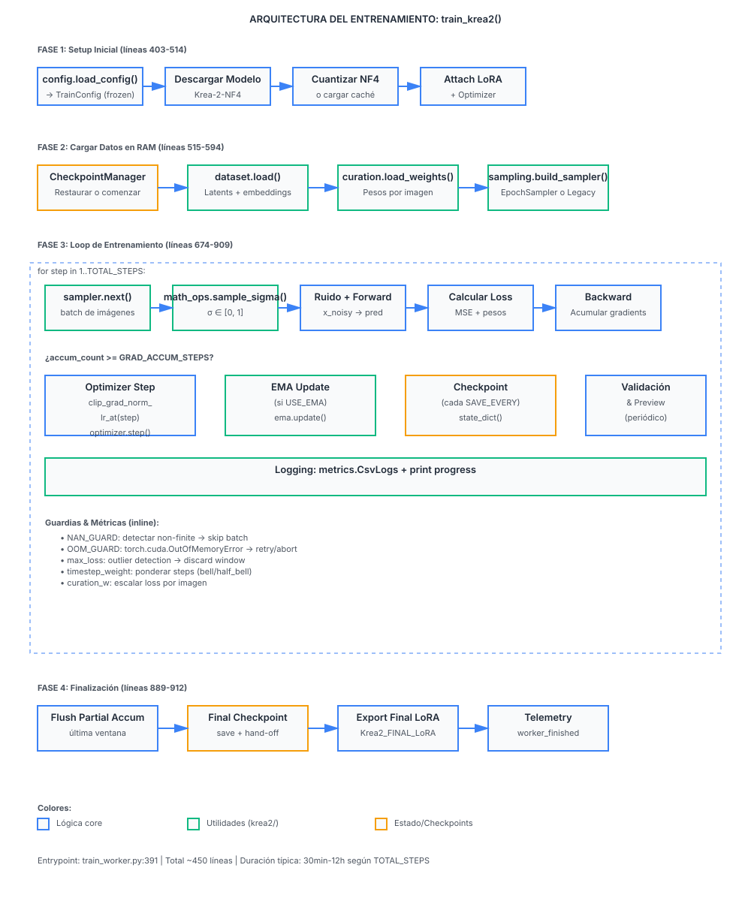

# xFTI-feature (Feature Pipeline Hub)

**Feature Pipeline Hub** is an end-to-end **LoRA (Low-Rank Adaptation) model training dataset curation and training execution** pipeline, usable two ways: interactively, through a Streamlit application with top-level page navigation, and programmatically, through an [MCP server](#-mcp-server-agent-integration) that exposes the same pipeline as tools for autonomous agents. It provides a unified pipeline for importing raw images and captions, visually curating and AI-recaptioning samples, performing perceptual deduplication and quality analytics, exporting versioned clean datasets, and launching/monitoring LoRA model training — with cross-dataset health and cost observability throughout.

---

## 🌟 Key Features

The application is organized into **five sequential pipeline steps** plus a standalone **Metrics** page, all accessible via top-level page navigation (Metrics first, then 1 · Import → 5 · Train):

### 📊 Metrics: Cross-Dataset Health & Pipeline Observability
* **Fleet Inventory**: A sortable table across *every* dataset — imported date, image/active/excluded/duplicate counts, missing-description count, invalid count, and median sharpness — plus headline totals (datasets, total images, active images, datasets with issues). Duplicate and sharpness figures are read from each dataset's last stored Quality-step verdict rather than recomputed live.
* **Per-Run Pipeline Telemetry**: Duration, error count, and throughput for each step (Import, Recaption, Quality, Export) of the active run, joined with its matching Training run (status, duration, GPU-seconds).
* **Training Metrics—Real Execution Data**: The Training row now reports **actual steps executed** (read from `train_log.csv`) rather than the configured target, correcting a longstanding issue where a run that crashed at step 400 of 3000 was reported as "3000 steps complete." Includes:
  * **Steps executed vs. target** — e.g., "400 / 3000 steps" when progress stalled, or "—" when no log is available.
  * **Completion percentage** — clamped to 100% if the run overshot its own target (possible after a resume).
  * **Wall-clock throughput** — seconds per step, computed from the process's elapsed time including model load and checkpointing.
  * **Four detailed tabs** (expanded view):
    * **Progress**: Steps, epochs, updates, and loss metrics (final, best, first, trend). Loss is dominated by the noise level sampled each step, not by model quality, so it tracks convergence within a run but not quality across runs.
    * **Time**: Wall clock, seconds/step, per-step timing from the CSV, and peak allocated VRAM (cumulative over the process; read lower than `nvidia-smi`).
    * **Dataset & config**: Active images, images-per-epoch estimate (derived from sampler epochs and batch size), resolution buckets actually trained, and all hyperparameters from the most recent launch.
    * **Health**: Skipped optimizer updates (non-finite gradients), loss spikes (heuristic), gradient norm distribution (p50, p95, max), and resume history (launches, steps rewound, seams where step rewound after a checkpoint restore).
  * **Lineage aggregation**: A resume reuses the same `output_dir`, so the panel groups N training_runs rows that share one CSV; completion and metrics reflect the whole lineage, not one launch.
  * **Honest missing data**: A run with no measurable log shows "—", never borrows the target from config. A stopped run that killed before exiting gracefully has full metrics from the CSV but no duration; a run the UI doesn't know about has nothing.
* **Cost Tiles**: Ingestion cost, training cost, and total cost estimates (`st.metric` tiles) computed from GPU-seconds emitted by the training/pre-cache workers and an hourly rate you configure (see `FTI_GPU_HOURLY_RATE` below). Note: GPU-seconds is wall-clock time the process held the GPU, not measured utilization.
* Not gated behind an active run — the fleet inventory half is visible with no dataset selected.

### 1. 📥 Step 1: Import & Ingestion
* **Three Ingestion Sources**:
  * **Local Directory Scan**: Ingest images directly from any local folder path. Files stay in place — nothing is copied or renamed.
  * **Browser File Uploads**: Drag-and-drop images (`.png`, `.jpg`, `.jpeg`, `.webp`) and optional `.txt` caption sidecar files via the UI. Uploaded datasets are persistently cached in `data/raw/<run_id>/`.
  * **Clone Existing Dataset**: Copy an existing run's images into a new, fully independent dataset with a new name. Captions are cloned from the database (the current edited version, not the original `.txt` sidecars), and are re-triggered if the new dataset uses a different trigger word. Perfect for creating variants (e.g., same images under different LoRA concepts) without re-uploading or re-curating.
* **Concept & Trigger Word Assignment**: Define a dataset **Concept Name** (e.g., `Cyberpunk Style`) and **Trigger Word**. Trigger Word auto-fills as a slugified version of Concept Name (`cyberpunk_style`) as you type, and stops following it the moment you edit it by hand. Trigger words are automatically prefixed to captions during ingestion if not already present.
* **Standardized Image Naming**: Uploaded images (Step 1's "Upload files" and Curate's "Add images", below) are renamed to `<concept_slug>_0001.ext`, `<concept_slug>_0002.ext`, … regardless of their original filename, so a dataset's images are traceable to a single, predictable naming scheme. Folder-scanned imports keep their original filenames, since that source is never copied into the app's own storage.
* **Automated Validation**: Enforces a minimum image resolution (both sides ≥ 512×512px, **or** either side alone ≥ 1024px — a tall or wide crop can carry enough detail on one axis even if the other falls short), validates file extensions, and checks caption character lengths (3 to 500 characters). A validation rule change doesn't retroactively touch datasets imported under the old rule until "Revalidate" (below) is run.
* **Persistent Ingestion Runs**: Stores dataset runs in a local SQLite database (`feature_pipeline.db`), allowing runs to survive app restarts and remain selectable via the global context bar. Re-scanning the same concept creates a new, independently-selectable run rather than overwriting the previous one.

### 2. 🎨 Step 2: Curate & AI Recaptioning
* **Interactive Curation Grid**:
  * Displays square, letterboxed, theme-adaptive thumbnails with an adjustable column layout slider (2 to 6 columns) — thumbnail resolution adapts to column count.
  * Click any thumbnail to open it full-size in a modal, with a "true size" toggle for viewing unscaled pixels with scroll — useful for judging focus and compression artifacts without the resampling a scaled preview would introduce.
  * Filter grid views: `Active`, `All`, `Duplicates`, `Invalid`, `No caption`, and `Excluded`.
* **In-Place Caption Editing**: Edit text captions directly underneath each thumbnail with instant SQLite database persistence.
* **Batch Caption Editing** (Accessible via the **`F2` keyboard shortcut** or "Captions" toolbar button):
  * **Replace Word Mode**: Replace specific exact terms across captions in a configurable scope (Seleccionadas / Filtro actual / Todas).
    * Displays exact match counts and matching sample previews before executing the replacement.
    * Case-sensitive matching for precision.
  * **Append Word Mode**: Add a word or phrase to the end of captions, with automatic deduplication.
    * Skips images that already contain the word (case-insensitive, anywhere in the caption).
    * Shows how many images will be updated and how many already have the word.
    * Safely idempotent: re-running over overlapping scopes does not duplicate terms.
* **Add Images to an Existing Dataset**: Upload images you forgot the first time without starting over — existing exclusions, edited captions, and duplicate flags on the rest of the dataset are left untouched. New images are compared against the dataset already in place and flagged as duplicates if a near-match already exists, and continue the same `<concept_slug>_NNNN` naming sequence Import uses.
* **Sample Inclusion & Exclusion**: Exclude specific images from the final dataset without deleting files from disk.
* **AI Recaptioning Engine (Qwen3-VL-4B) with Structured Captioning**:
  * Regenerates captions using the **Qwen3-VL-4B** vision-language model (the text encoder model used by Krea 2).
  * **Two structured captioning modes** (not free-form prose — fixed JSON slots assembled deterministically):
    * **Subject Mode** (default): Describes shot type, pose, clothing, background, and lighting — *deliberately omits* face, hair, and body type so the LoRA's trigger word can learn those traits instead.
    * **Location Mode**: Describes time of day, weather, lighting, and transient objects — *deliberately omits* architecture and place style so the trigger word absorbs those properties.
  * Both modes use explicit prohibitions (e.g., "Do NOT describe facial features") and enforce slot-based responses, guaranteeing that what the caption omits gets absorbed into training by the trigger word.
  * Runs as an isolated subprocess (`workers/recaption_worker.py`), streaming live progress (model loading, per-image timing, success/error counters) and releasing GPU VRAM on completion.
  * **GPU Fallback Notice**: If the GPU is too full, the worker gracefully falls back to CPU (visible warning in the UI) — still produces correct captions, but at minutes per image instead of ~2s.
  * Preserves original captions as `.txt.bak` backups while updating both the database and `.txt` sidecars on disk.
  * Validates model weights on load; reports any corrupted tensors with actionable diagnostics (memory/hardware issues, not data).

### 3. 🔍 Step 3: Quality Analysis & Deduplication
* **Multi-Hash Perceptual Deduplication**:
  * Combines **pHash** (Perceptual Hash) and **dHash** (Difference Hash) to identify near-duplicate, cropped, or re-encoded images.
  * Features a color-guard check to prevent false positives on flat backdrops or low-detail renders with distinct colors.
  * Adjustable sensitivity slider (max perceptual distance from 0 to 16).
  * **One-Click Action**: Exclude all detected duplicates while keeping one master image per group.
  * Every thumbnail in a duplicate cluster opens the same full-size zoom modal available in Curate, for comparing near-duplicates at true resolution before deciding what to keep.
* **Sharpness (Blur) Ranking**: Surfaces the least-sharp images in the dataset first, by Laplacian variance, with a one-click exclude button per image — the fastest way to weed out out-of-focus shots before they reach training.
* **Caption Completeness Checks**:
  * Identifies images lacking descriptive text (or containing only the trigger word).
  * Provides quick-edit input fields on the quality dashboard to fill missing descriptions.
* **Orphan File Detection**: Flags images with no matching `.txt` caption sidecar and captions with no matching image, for datasets imported by folder path.
* **Dataset Analytics & Distribution Charts** (in a "Statistics" panel):
  * **Resolution Distribution**: Interactive bar charts for image dimensions (W × H).
  * **Aspect Ratio Classification**: Categorizes ratios into standard buckets (`1:1`, `4:3`, `3:4`, `16:9`, `9:16`, `3:2`, `2:3`, `other`).
  * **Orientation Balance**: Portrait vs. landscape vs. square counts.
  * **Caption Length Distribution**: Histogram of word counts per sample, highlighting captions that risk truncation by the text encoder's token budget during training.

### 4. 📦 Step 4: Export & Versioning
* **Materialize Flat Training Dataset**:
  * Exports all Active (non-excluded) samples of the current run as paired `<name>.png|.jpg` + `<name>.txt` files into `training_runtime/datasets/<destination_name>/`.
  * Formats files into the exact flat layout expected by the training worker scripts in Step 5.
  * Automatically disambiguates filename stem collisions.
  * Includes overwrite warnings and an inline two-step confirmation workflow.
* **Dataset Versioning & Change Detection**:
  * Each export is tagged with a version (auto-suggested as the next `vN`) and recorded with a content-hash manifest — the previous version's tag, timestamp, and sample count are always shown before you export again.
  * The content hash is built from the (perceptual-hash, caption) pair of every active sample, so it changes if an image is added/removed/excluded or a caption is edited, but not if files are simply re-encoded to identical-looking bytes.
  * If nothing changed since the last export, the panel says so plainly ("Identical to `vN`") instead of writing a redundant version; if something did, it shows a field-by-field delta (sample count, duplicates, median sharpness, mean caption words) against the previous version.

### 5. 🏋️ Step 5: Train & Live Monitoring
* **Self-Contained Training Runtime**:
  * Runs training on a dedicated, isolated Python environment (`training_runtime/venv`) equipped with PyTorch, Diffusers, Accelerate, BitsAndBytes, PEFT, and Transformers — none of which are dependencies of the hub app itself (see "Setup & Provisioning" below).
  * One-time setup script (`scripts/setup_training_runtime.sh`) copies the required model weights (~46GB Krea-2-NF4) and provisions dependencies.
* **Hyperparameter Configuration**:
  * Configurable parameters: `Total steps`, `Learning rate`, `LoRA rank`, `LoRA alpha`, `Batch size`, `Grad accumulation steps`, `Save every` checkpoint interval, and `Seed`.
* **Two-Stage Execution**:
  1. **Pre-Cache Stage (Blocking)**: Runs `workers/precache_worker.py` to pre-compute VAE latents and text embeddings into `training_runtime/cache/<dataset_name>/`.
  2. **Training Stage (Detached Process)**: Runs `workers/train_worker.py` in a detached process group (`start_new_session=True`). Continues running in the background even if Streamlit is closed or restarted.
* **Real-Time Monitoring Dashboard**:
  * Auto-refreshing UI fragment (`@st.fragment(run_every="5s")`) displaying live training loss curves (`train_log.csv`), stdout log tailing, elapsed duration, and a running cost estimate once GPU-seconds are available.
  * **Stop Training**: Send SIGINT for graceful checkpoint saving before escalating to process termination. Metrics (steps executed, loss, gradient health) are persisted immediately, so a gracefully stopped run has full observability even though it did not reach the target.
  * Full run execution history tracked in SQLite (`training_runs` table), including steps executed, a snapshot of training metrics from `train_log.csv`, GPU-seconds, and cost estimate — all backfilled once the process exits. This enables the Metrics page to report honest numbers even after the training runtime directory is reclaimed.

---

## 🔭 Observability & Telemetry

Three independent mechanisms feed the Metrics page and keep it honest without the UI having to poll a live process:

* **Step telemetry** (`ui/step_telemetry.py`): each UI step (Import, Recaption, Quality, Export) times itself and records duration + error count into that run's `ingestion_runs` row.
* **Training log parsing** (`domain/train_log.py`): pure parsing and aggregation of `train_log.csv` (written by the trainer with one row flushed per optimizer update). Tolerates missing columns (logs predating `secs` and `vram_peak_gb`), non-monotonic step numbers (resume seams where training rewound), and torn final lines (killed mid-write). Computes: steps executed (max step), loss trend, epoch distribution, gradient health (skipped updates, norm percentiles), resolution bucket mix, and learned hyperparameters (LR peak/final). Served by `training_service.read_train_log_summary()` and aggregated across resume lineages by `training_metrics_service`.
* **Worker lifecycle events**: `workers/precache_worker.py` and `workers/train_worker.py` are ported from the upstream LoRAlab project and are never instrumented directly — `workers/_telemetry.py` wraps only their `__main__` entrypoints from the outside, emitting one structured JSON line per lifecycle transition (`worker_started` / `worker_finished` / `worker_failed`, with duration and GPU-seconds) to the same stdout the training log already streams to. `training_runner.py` reads the last ~4KB of a (possibly multi-hour) log file to find that final line cheaply, and `training_service.finalize_dead_run()` uses it to backfill `training_runs.gpu_seconds` / `cost_estimate`.
  * **Stopped runs get metrics too**: `stop_training` reads the CSV and persists the summary immediately (not waiting for a lifecycle event), so a gracefully stopped run has steps_executed and full health metrics even though `finalize_dead_run` will never see it.
  * **Persisted snapshots**: The training metrics summary is stored as JSON in `training_runs.metrics_json` when a run finalizes, so the panel can still report real numbers even after `training_runtime/` is deleted. Live CSV reads take precedence (covering the whole resume lineage), falling back to stored snapshots if the file is gone.

Recaptioning uses a related but separate JSON-lines protocol (`LoadedEvent` / `CaptionEvent` / `ErrorEvent` / `DoneEvent`) defined in `domain/worker_contracts.py`, streamed live rather than tailed after the fact, since that worker runs blocking in the foreground.

---

## 🔌 MCP Server: Agent Integration

Alongside the Streamlit UI, `mcp_server/` exposes the same pipeline as [Model Context
Protocol](https://modelcontextprotocol.io/) tools, so an autonomous agent (e.g. a
LangGraph graph) can inspect dataset inventory and drive LoRA training end-to-end
without a human clicking through the 5 steps. It's a separate process talking to the
same SQLite DB (`feature_pipeline.db`) and `training_runtime/` — the same "separate
process, shared state" pattern already used by `workers/`.

### Running it

```bash
cd feature_pipeline_hub
uv run python -m mcp_server
```

This starts the server on **stdio** — the transport MCP clients (LangGraph's
`langchain-mcp-adapters`, Claude Desktop, the `mcp` CLI inspector, etc.) launch as a
subprocess and talk to over stdin/stdout. There is no network listener and no
authentication layer (this app has none anywhere — it was built as a local,
single-user tool), so **do not** put this server behind an HTTP/SSE transport or
expose it beyond a trusted local agent without adding an auth layer first.

### Available tools

| Tool | What it does |
|---|---|
| `list_dataset_runs` | Every stored ingestion run, newest first (no samples loaded — cheap). |
| `get_dataset_health` | Fleet-wide health: counts, duplicates, median sharpness per dataset. |
| `get_run_detail` | Full detail of one run, including every sample's caption/metrics/flags. |
| `import_dataset` | Ingest a new dataset from a local folder of images (+ optional `.txt` captions). |
| `revalidate_run` | Re-check samples against current validation rules (one run, or every run). |
| `export_dataset` | Materialize a run's active samples as a flat training folder (Step 4's job). |
| `quality_summary` | Headline quality counts (active/excluded/duplicate/missing-caption/invalid). |
| `start_lora_training` | Launch pre-cache for a run; returns immediately (non-blocking). |
| `get_training_status` | Poll a pre-cache or train job by `training_run_id`. |
| `continue_lora_training` | Once pre-cache is `completed`, launch the training phase (detached). |
| `stop_training` | Send a graceful stop (SIGINT) to a running job. |

Training is intentionally split into `start_lora_training` → poll
`get_training_status` → `continue_lora_training`, rather than one call: the UI's
`start_training` blocks the caller for up to 20 minutes while pre-cache runs
(`PRECACHE_TIMEOUT_SECONDS`), which is fine for a Streamlit button but not for an MCP
tool call. Every tool call opens and closes its own SQLite connection — same
convention `ui/state.py` uses — and `start_lora_training` refuses to launch if a
training-runtime job is already active, whether it was started from the UI or another
agent call.

---

## 🛠️ Setup & Provisioning

### Training Runtime Provisioning

Both Step 2 (AI Recaptioning) and Step 5 (Train) run against the same self-contained
`training_runtime/` — a local copy of the Krea-2-NF4 weights (including the Qwen3-VL
text encoder used for captioning) plus a dedicated venv. Run the one-time provisioning
script, pointed at an existing [AcademiaSD_LoRAlab-Krea2](https://github.com/xd43vild69/AcademiaSD_LoRAlab-Krea2)
checkout, to copy the weights (~46GB) and set up the environment:

```bash
FTI_LORALAB_ROOT=/path/to/AcademiaSD_LoRAlab-Krea2 ./scripts/setup_training_runtime.sh
```

That checkout is only needed for this one-time copy — once `training_runtime/` exists,
neither recaptioning nor training reach back out to it, and the app runs standalone
against its own local model + venv. The hub app's own dependencies (`pyproject.toml`)
are deliberately lightweight — Streamlit, Pydantic, Pillow, imagehash, numpy, the `mcp`
SDK — none of the PyTorch/Diffusers/training stack is installed into the app's own
environment.

---

## ⚙️ Environment Variables

| Variable | Description | Default Value |
|---|---|---|
| `FTI_TRAINING_RUNTIME_DIR` | Directory holding model weights, datasets, cache, and the shared venv used by both recaptioning and training | `feature_pipeline_hub/training_runtime` |
| `FTI_TRAINING_PYTHON` | Python interpreter for training and recaption workers | `<FTI_TRAINING_RUNTIME_DIR>/venv/bin/python` |
| `FTI_DB_PATH` | Path to the SQLite metadata database file | `feature_pipeline_hub/data/feature_pipeline.db` |
| `FTI_DATA_DIR` | Base directory for raw dataset uploads | `feature_pipeline_hub/data` |
| `FTI_GPU_HOURLY_RATE` | Your GPU's hourly rate, used to turn recorded GPU-seconds into a cost estimate on the Metrics page and Train dashboard | unset — cost is left unestimated rather than guessed at |
| `FTI_RUN_ID` | Set by the launcher (not the user) so a worker's telemetry events carry its own run id | — |

---

## 📐 Architecture & Project Structure

The project follows Clean Architecture principles: `domain` has no I/O and no framework dependencies; `application` holds business logic and depends on `domain` + infrastructure interfaces, not on Streamlit; `infrastructure` handles persistence, the filesystem, and subprocess launching; `ui` is Streamlit-only and is the sole place that talks to both `application` and the database (through `ui/state.py`).

```
feature_pipeline_hub/
├── main.py                        # Launcher script
├── pyproject.toml                 # Project configuration & dependencies
├── CONTRIBUTING.md                # Git workflow & commit conventions
├── scripts/
│   └── setup_training_runtime.sh  # Provisioning script for training venv & model weights
├── src/
│   └── feature_pipeline/
│       ├── domain/                # Core domain models & pure logic — no I/O
│       │   ├── models.py          # DatasetSample, ConceptGroup, IngestionRun, DatasetManifest
│       │   ├── validators.py      # Extension, resolution & caption validation rules
│       │   ├── naming.py          # Concept-name slugging & standardized image filenames
│       │   ├── worker_contracts.py# Pydantic schemas for worker settings-in / events-out
│       │   ├── train_log.py       # Parsing & summarizing train_log.csv (tolerates resumes & torn rows)
│       │   └── cost.py            # GPU-seconds → estimated cost
│       ├── application/           # Business logic & services
│       │   ├── dataset_service.py # Ingestion, append, revalidation & dataset assembly
│       │   ├── caption_service.py # Text normalization & trigger word injection
│       │   ├── image_service.py   # pHash, dHash, colorhash, thumbnail generator
│       │   ├── quality_service.py # Perceptual deduplication, sharpness & quality metrics
│       │   ├── inventory_service.py # Cross-dataset health inventory for the Metrics page
│       │   ├── training_metrics_service.py # Training lineage aggregation (resumes grouped by output_dir)
│       │   ├── recaption_service.py # AI recaptioning orchestrator
│       │   ├── export_service.py  # Flat dataset exporter for training
│       │   └── training_service.py# Pre-cache & training process orchestrator
│       └── infrastructure/        # Data access & process runners
│           ├── database.py        # SQLite schema, tables & ALTER-TABLE column migrations
│           ├── ingestion_repository.py # Run & sample CRUD persistence
│           ├── version_repository.py   # Dataset export version (manifest) persistence
│           ├── training_repository.py  # Training run status & log persistence
│           ├── storage.py         # File storage, standardized naming & directory helpers
│           ├── recaption_runner.py# Streaming subprocess launcher for the Qwen3-VL worker
│           ├── training_runner.py # Detached process launcher & log reader for training
│           └── hf_exporter.py     # Placeholder for a future HF/Parquet/Kohya export layout
├── ui/                             # Streamlit UI Layer
│   ├── app.py                      # Entry point & page navigation (Metrics + 5 steps)
│   ├── state.py                    # Session state & UI persistence helpers — the only bridge to SQLite
│   ├── step_telemetry.py           # Per-step duration/error timing, feeds the Metrics page
│   ├── steps/                      # Thin page wrappers: Import, Curate, Quality, Export, Train, Metrics
│   └── components/                 # UI panels: Import, Gallery, Image Zoom, Recaption, Quality,
│                                    #   Export, Train, Context Bar, Inventory, Observability
├── mcp_server/                     # MCP server: pipeline tools for autonomous agents (stdio transport)
│   ├── server.py                   # FastMCP tool definitions, thin wrappers over application/
│   └── __main__.py                 # `uv run python -m mcp_server` entrypoint
├── workers/                        # Worker scripts, run as separate processes in a different venv
│   ├── recaption_worker.py         # Qwen3-VL recaption worker
│   ├── caption_qwen3vl.py          # Vendored Qwen3-VL loading/captioning (ported from LoRAlab)
│   ├── precache_worker.py          # VAE & text embedding pre-cache worker (vendored, byte-for-byte)
│   ├── train_worker.py             # LoRA training entrypoint (being split into krea2/)
│   ├── krea2/                      # Trainer package: config/, sampling/, curation/, checkpoints/ are
│   │                               #   torch-free and covered by mypy + tests/workers/
│   └── _telemetry.py               # Wraps precache/train's __main__ with lifecycle JSON events
```

---

## 🏋️ Training Architecture & Orchestration

The training phase (Step 5) is orchestrated by `workers/train_worker.py:train_krea2()` — a ~450-line function that manages model loading, dataset batching, the micro-step loop, checkpointing, and LoRA export. Below is the complete flow:

### Diagram: Training Orchestration



### Four Phases

#### **Phase 1: Setup (Lines 403–514)**
1. **Config Resolution** (`config.load_config()`)
   - Reads `train_settings.json`, `train_advanced.json`, optional preset, and DEFAULTS
   - Returns an immutable `TrainConfig` object; all 60+ parameters live here
   - Resolves paths, validates enums, and computes derived values (e.g., `total_updates = total_steps / grad_accum_steps`)

2. **Model & Quantization**
   - Download Krea-2-NF4 from HuggingFace (if not already local)
   - Load the 12B transformer and scheduler into GPU memory
   - Quantize to NF4 in-place, OR load a cached NF4 snapshot (~3 minutes vs. ~1 hour)

3. **LoRA Attachment**
   - Wrap the frozen base transformer with PEFT LoRA adapters
   - Set LoRA dtype (bf16 for speed, fp32 for precision)
   - Build the optimizer (AdamW8bit paged, AdamW8bit, or AdamW)

4. **Optional EMA**
   - If `use_ema=True`, create an Exponential Moving Average shadow of LoRA weights
   - Used for validation loss and preview generation (smoother, more stable)

#### **Phase 2: Load Data (Lines 515–594)**
1. **Checkpoint Manager** (`state.CheckpointManager`)
   - Attempt to restore a previous checkpoint (if resuming a run)
   - If starting fresh (`start_step == 0`), load weights from a prior phase (multi-phase training)

2. **Dataset Loading** (`dataset.load()`)
   - Read all pre-cached VAE latents + text embeddings into RAM
   - Bucket images by resolution `(H, W)` to respect model constraints
   - Optional validation/training split (holdout for quality measurement)

3. **Curation Weights** (`curation.load_weights()`)
   - Load per-image training weights from `curation_report.json`
   - Allow manual overrides from `curation_overrides.json`
   - If all weights = 1.0, skip (for bit-identical reproducibility with uncurated runs)

4. **Sampler Construction** (`sampling.build_sampler()`)
   - **EpochSampler** (recommended): every image seen exactly once per epoch; fair coverage
   - **LegacySampler** (legacy): uniform over buckets; can bias small buckets

#### **Phase 3: Training Loop (Lines 674–909)**
Each micro-step (`for step in 1..TOTAL_STEPS`):

1. **Batch & Sigma Sampling**
   - `sampler.next()` → fetch a batch of image names from the current bucket
   - `math_ops.sample_sigma()` → sample flow-matching timestep (σ ∈ [0, 1]) per image
     - Modes: logit_normal, content (favor fine detail), style (favor composition)

2. **Forward Pass**
   - Pack latents into token sequences: `[B, C, H, W] → [B, (H/2)*(W/2), C*4]`
   - Generate position IDs for RoPE (row, col coordinates)
   - Add Gaussian noise scaled by σ: `x_noisy = (1 - σ) * x + σ * noise`
   - Predict noise residual through the transformer

3. **Loss Computation**
   - Base loss: MSE between predicted and target noise
   - **Timestep weighting** (optional): bell/half_bell curves favor σ ≈ 0.5
   - **Curation weights**: scale per-image loss (per-image learning rate)
   - **Gradient accumulation**: defer optimizer step for `grad_accum_steps` micro-steps

4. **Guards & Metric Collection**
   - **NaN Guard**: detect non-finite loss → skip batch, track count, abort after N
   - **OOM Guard**: catch CUDA OOM → free VRAM, retry, abort after N consecutive
   - **Max Loss**: outlier detection; discard window if loss exceeds threshold
   - **Validation Loss** (every `validate_every` steps): hold-out MSE at fixed sigmas
   - **Preview Generation** (every `preview_every` steps): sample an image with current weights

5. **Optimizer & State Updates**
   - After `grad_accum_steps` accumulated backwards:
     - `torch.nn.utils.clip_grad_norm_()` with `max_grad_norm`
     - Update learning rate per schedule: cosine, constant, linear, step, or cosine_with_restarts
     - `optimizer.step()` + `optimizer.zero_grad()`
     - EMA weight update (if enabled)

6. **Logging & Checkpointing**
   - Write to CSV: step, loss, grad_norm, LR, sigma, bucket size, VRAM peak, seconds/step
   - Console output: progress bar with running loss, gradient norm, LR, epoch number
   - Save full checkpoint atomically every `save_every` steps (model, optimizer, sampler RNG, EMA state)

#### **Phase 4: Finalization (Lines 889–912)**
1. **Flush Partial Accumulation**
   - If `total_steps` is not a multiple of `grad_accum_steps`, apply leftover accumulated gradients

2. **Final Checkpoint & Hand-Off**
   - Save `resume_checkpoint/` (for multi-phase continuity)
   - Export `Krea2_FINAL_LoRA.safetensors` (flattened, safe-tensor format)
   - Emit telemetry: `worker_finished` with duration + GPU-seconds

### Utility Classes

| Class | Module | Purpose |
|-------|--------|---------|
| **TrainConfig** | `config.py` | Immutable dataclass holding all 60+ resolved training parameters |
| **EpochSampler** / **LegacySampler** | `sampling.py` | Batch generator that respects resolution buckets |
| **CheckpointManager** | `state.py` | Atomic save/restore of model, optimizer, sampler, EMA; handles SIGINT/SIGTERM |
| **EMA** | `ema.py` | Exponential moving average of LoRA weights for stable validation/preview |
| **CsvLogs** | `metrics.py` | Structured CSV logging of loss, LR, grad_norm, sigma, VRAM, timing |
| **DatasetHolder** | `dataset.py` | Loader returning `{name: (latent, embedding, mask)}` + buckets |
| **math_ops*** | `math_ops.py` | Tensor operations: sigma sampling, timestep weighting, latent packing |
| **schedule*** | `schedule.py` | Learning rate schedule evaluation per step |
| **curation*** | `curation.py` | Per-image loss scaling from curation report + overrides |

### Checkpoint Format

A checkpoint saves:
- **Model weights** (LoRA adapter state)
- **Optimizer state** (AdamW momentum, variance, step counter)
- **Current step** and epoch
- **Sampler RNG state** (JSON-serializable for reproducibility on resume)
- **EMA weights** (if enabled)

Checkpoints are deterministic: restoring `step=1000` and re-training from there produces identical results (same RNG seeds, same batch order, same gradient flow).

### Multi-Phase Training

When `phase_count > 1`, each phase:
1. Uses explicit `TRAIN_SETTINGS_PATH` / `TRAIN_ADVANCED_PATH` (set by orchestrator)
2. Begins by loading previous phase's LoRA as initialization (`init_lora_from`)
3. Runs its configured `total_steps` (often at a different resolution/batch size)
4. Saves its own checkpoint; next phase loads from `resume_checkpoint/`

The orchestrator (external to this file) manages `phase_index`, `global_step_offset`, and `global_total_steps` for progress tracking and cost estimation.

---

## 🚀 How to Run

### Prerequisites
* Python 3.11+
* [`uv`](https://github.com/astral-sh/uv) (recommended) or `pip`

### Running the App

```bash
cd feature_pipeline_hub
uv run streamlit run ui/app.py
```
Or via the launcher script:
```bash
cd feature_pipeline_hub
uv run python main.py
```

---

## ⌨️ Shortcuts & UI Helpers

* **`F2`**: Opens the **Captions** dialog in Curate for batch editing: replace a word across captions, or append a word to the end of selected/filtered/all images.
* **Click any thumbnail**: Opens it full-size in a modal (Curate and Quality), with a toggle for viewing true, unscaled pixels.
* **Global Context Bar**: Persistent top header bar to switch active datasets, monitor real-time health badges (active count, duplicate count, missing descriptions, excluded count), view concept details, re-run validation against the current rules ("Revalidate"), or delete dataset runs.

---

## 🧪 Running Tests

Run the pytest test suite:

```bash
cd feature_pipeline_hub
uv run pytest
```

---

## ⚙️ Continuous Integration

`.github/workflows/python-app.yml` runs on every push and pull request to `main`:

1. **`uv sync --locked`** — installs the exact dependency set from `uv.lock`.
2. **`mypy`** — strict, Pydantic-aware type-checking (`pydantic.mypy` plugin) over
   `src/feature_pipeline/` and `mcp_server/`, where the domain models and the tools an
   agent calls actually live. plus the torch-free
   modules under `workers/krea2/`. `ui/` (Streamlit) and the rest of `workers/` — which
   import torch, unavailable in this environment — are deliberately out of scope.
3. **`pytest`** — the full test suite (caption normalization, validation rules,
   deduplication, export integrity, MCP tools, and more), the gate against a change
   silently breaking caption quality or a dataset export.

Both steps must pass before a change can be considered safe to merge.

---

## 🤝 Contributing

See [`feature_pipeline_hub/CONTRIBUTING.md`](feature_pipeline_hub/CONTRIBUTING.md) for git branch strategy, commit conventions, and workflow. `.claudecodingrc` at the repo root encodes the same conventions for AI coding agents working in this repo.
