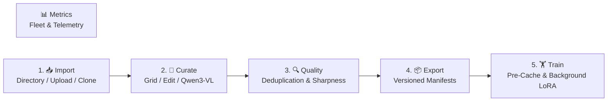

# xFTI-feature (Feature Pipeline Hub)

[](https://github.com/xd43vild69/xFTI-feature/actions/workflows/python-app.yml)
[](https://www.python.org/downloads/)
[](ARCHITECTURE.MD)
[](feature_pipeline_hub/mcp_server/)

**Feature Pipeline Hub** is an end-to-end dataset curation, quality analysis, and LoRA model training execution platform for generative diffusion models (supporting **Krea 2** and **LTX-2.3**).

The platform is designed with a dual-interface architecture:
1. **Interactive Web UI**: A fast, responsive [Streamlit](https://streamlit.io/) application for visual curation and training execution.
2. **Autonomous Agent Integration**: A native [Model Context Protocol (MCP)](https://modelcontextprotocol.io/) server (`mcp_server`) paired with an autonomous host agent ([`fti-agent`](agent/README.md)) that can inspect datasets and orchestrate LoRA pipelines programmatically.

---

## 🏛️ Architectural Pillars

The system is built around four core architectural principles:

```
┌─────────────────────────────────────────────────────────────┐
│                       Presentation Layer                    │
│      Streamlit Web UI (ui/)   │   MCP Server (mcp_server/)  │
│                               │   Autonomous Agent (agent/) │
└──────────────────────────────┬──────────────────────────────┘
                               │
┌──────────────────────────────▼──────────────────────────────┐
│                    Application Services                     │
│  Dataset · Quality · Recaption · Export · Training · Metrics│
└──────────────────────────────┬──────────────────────────────┘
                               │
┌──────────────────────────────▼──────────────────────────────┐
│                        Domain Core                          │
│     Models · Validators · Contracts · Log Parsers · Cost    │
│                  (Zero I/O, Pure Logic)                     │
└──────────────────────────────┬──────────────────────────────┘
                               │
┌──────────────────────────────▼──────────────────────────────┐
│                   Infrastructure & Workers                  │
│   SQLite Persistence  │  Disk Storage  │  Subprocess venv   │
│   (State & Metadata)  │ (Raw & Cache)  │  (Qwen3-VL/Krea2)  │
└─────────────────────────────────────────────────────────────┘
```

1. **Clean Architecture & Separation of Concerns**:
   - **Domain**: Pure data structures and business validation rules with zero dependencies on frameworks or I/O.
   - **Application**: Service orchestration (curation, deduplication, export, training, and metric aggregation).
   - **Infrastructure**: SQLite repository layer, disk caching, and detached subprocess management.
   - **Presentation**: Dual entry points (Streamlit UI and FastMCP tools) sharing the exact same application services.

2. **Process Isolation & Lightweight Core**:
   - The hub's core dependencies (`pyproject.toml`) are deliberately lightweight (Streamlit, Pillow, Pydantic, NumPy, ImageHash, MCP) without PyTorch or heavy ML dependencies.
   - Resource-intensive ML tasks (VLM recaptioning, VAE latent pre-caching, LoRA training) run as isolated subprocesses in dedicated virtual environments (`training_runtime/venv`), releasing GPU VRAM immediately upon completion.

3. **Honest Observability & Resilient Telemetry**:
   - Training observability is derived directly from live-streamed `train_log.csv` records rather than theoretical target configurations. A stopped or interrupted run accurately displays real completed steps, loss convergence, and gradient health.
   - Telemetry tracks GPU-seconds and estimates costs across multi-phase and checkpoint-resume training lineages.

4. **Agent-First Extensibility (MCP)**:
   - Every core pipeline capability is exposed as a structured MCP tool via `mcp_server/`. Autonomous agents (`fti-agent`) can query fleet health, import datasets, perform validation, and run training jobs in a safe, tool-assisted loop.

---

## 🔄 The 5-Step Pipeline + Metrics



### 📊 Metrics: Cross-Dataset Health & Observability
- **Fleet Inventory**: Cross-dataset summary tracking active samples, duplicates, invalid files, missing captions, and sharpness scores.
- **Real-Time Training Telemetry**: Real execution tracking (actual steps executed vs. target, loss trend, VRAM peaks, learning rate schedule, skipped updates due to non-finite gradients).
- **GPU Cost Estimation**: Wall-clock GPU-second tracking translated to monetary cost using configurable hourly rates (`FTI_GPU_HOURLY_RATE`).

### 1. 📥 Import & Ingestion
- **Three Ingestion Sources**: Local directory scanning (zero copy), browser drag-and-drop upload, or cloning existing dataset runs with trigger word re-triggering.
- **Concept & Trigger Word Normalization**: Automated trigger word prefixing and standardized naming (`<concept_slug>_NNNN.ext`).
- **Validation**: Automatic filtering on image dimensions (min. 512×512px or single-axis ≥1024px) and caption length constraints.

### 2. 🎨 Curate & AI Recaptioning
- **Visual Curation Grid**: Dynamic multi-column gallery with sample exclusion/inclusion, status badges, and true-size unscaled pixel inspection.
- **Caption Editing**: In-place inline editing and **Batch Caption Editing (`F2`)** supporting scoped term replacement and idempotent word appending.
- **Structured AI Recaptioning**: Integrated **Qwen3-VL-4B** vision-language model with two structured slot-based modes:
  - *Subject Mode*: Omits identity traits to let LoRA trigger words absorb them.
  - *Location Mode*: Omits architectural style to focus on transient scene dynamics.

### 3. 🔍 Quality Analysis & Deduplication
- **Multi-Hash Perceptual Deduplication**: Combined **pHash** and **dHash** with color-guard checks to prevent false positives on uniform backgrounds, featuring one-click duplicate resolution.
- **Laplacian Sharpness Ranking**: Automatic blur detection to surface and exclude out-of-focus samples.
- **Dataset Distribution Analytics**: Interactive visualizations for aspect ratio classifications, dimension distributions, and caption token lengths.

### 4. 📦 Export & Versioning
- **Flat Training Dataset Layout**: Exports active samples into paired `<name>.png|.jpg` + `<name>.txt` files ready for training runtimes.
- **Content-Hash Versioning**: Generates deterministic manifest hashes (perceptual hash + caption text) across versions (`v1`, `v2`, ...), detecting redundant exports and presenting clear delta summaries.

### 5. 🏋️ Train & Live Monitoring
- **Two-Stage Training Workflow**:
  1. *Pre-Cache Stage*: Computes and caches VAE latents and text embeddings.
  2. *Detached Training Stage*: Launches background trainer processes (`start_new_session=True`) that persist across UI sessions.
- **Live Training Dashboard**: Real-time loss curves, stdout log tailing, NaN/OOM error guards, and graceful checkpoint interrupts (SIGINT).

---

## 🚀 Quick Start

### Prerequisites
- Python 3.11+
- [`uv`](https://github.com/astral-sh/uv) package manager

### 1. Installation & Environment Setup
```bash
# Clone the repository
git clone https://github.com/xd43vild69/xFTI-feature.git
cd xFTI-feature/feature_pipeline_hub

# Install hub dependencies
uv sync
```

### 2. Provision Training Runtime (One-Time)
Provision model weights (~46GB Krea-2-NF4) and the dedicated training virtual environment:
```bash
FTI_LORALAB_ROOT=/path/to/AcademiaSD_LoRAlab-Krea2 ./scripts/setup_training_runtime.sh
```

### 3. Launching the Application
- **Start the Streamlit Web UI**:
  ```bash
  uv run python main.py
  # or: uv run streamlit run ui/app.py
  ```
- **Run the MCP Server (Agent Integration)**:
  ```bash
  uv run python -m mcp_server
  ```
- **Launch the Autonomous Host Agent**:
  ```bash
  cd ../agent
  uv sync
  cp .env.example .env   # Configure API keys
  uv run fti-agent
  ```

---

## ⌨️ Shortcuts & Navigation

| Key / Control | Action |
|---|---|
| **`F2`** | Open Batch Caption Editing dialog (replace / append terms across samples) |
| **Thumbnail Click** | Open modal zoom preview with true-pixel (1:1) toggle |
| **Global Context Bar** | Switch active dataset, monitor health badges, revalidate rules, or delete runs |

---

## 🧪 Testing & CI

```bash
# Run pytest test suite
cd feature_pipeline_hub
uv run pytest

# Run strict type checking
uv run mypy
```

Automated GitHub Actions workflows enforce `uv.lock` sync, strict `mypy` type checking (over domain, application, and MCP layers), and complete `pytest` validation on every push.

---

## 📂 Project Structure

```
xFTI-feature/
├── feature_pipeline_hub/          # Main Feature Pipeline Application
│   ├── src/feature_pipeline/
│   │   ├── domain/                # Pure business logic & validation models
│   │   ├── application/           # Ingestion, quality, export, & training services
│   │   └── infrastructure/        # SQLite persistence, storage, & subprocess runners
│   ├── ui/                        # Streamlit web app (pages & components)
│   ├── mcp_server/                # Model Context Protocol server (FastMCP tools)
│   ├── workers/                   # Isolated ML workers (Qwen3-VL, Krea2, LTX-2.3)
│   └── training_runtime/          # Dedicated training venv, cache, & model weights
├── agent/                         # Autonomous MCP Host Agent (fti-agent REPL)
├── docs/                          # Architecture diagrams & technical assets
├── ARCHITECTURE.MD                # Comprehensive technical architecture deep-dive
└── ARCHITECTURE_DEEP_DIVE.md      # Detailed system implementation reference
```

---

## 📖 Further Documentation

For deep technical details, worker lifecycle contracts, and detailed training loop specifications, refer to:
- [ARCHITECTURE.MD](ARCHITECTURE.MD) — Comprehensive architectural specification and domain modeling.
- [ARCHITECTURE_DEEP_DIVE.md](ARCHITECTURE_DEEP_DIVE.md) — In-depth component and worker analysis.
- [agent/README.md](agent/README.md) — Autonomous agent architecture, remote LLM tunnels, and usage guide.
- [CONTRIBUTING.md](feature_pipeline_hub/CONTRIBUTING.md) — Development workflow and commit standards.
